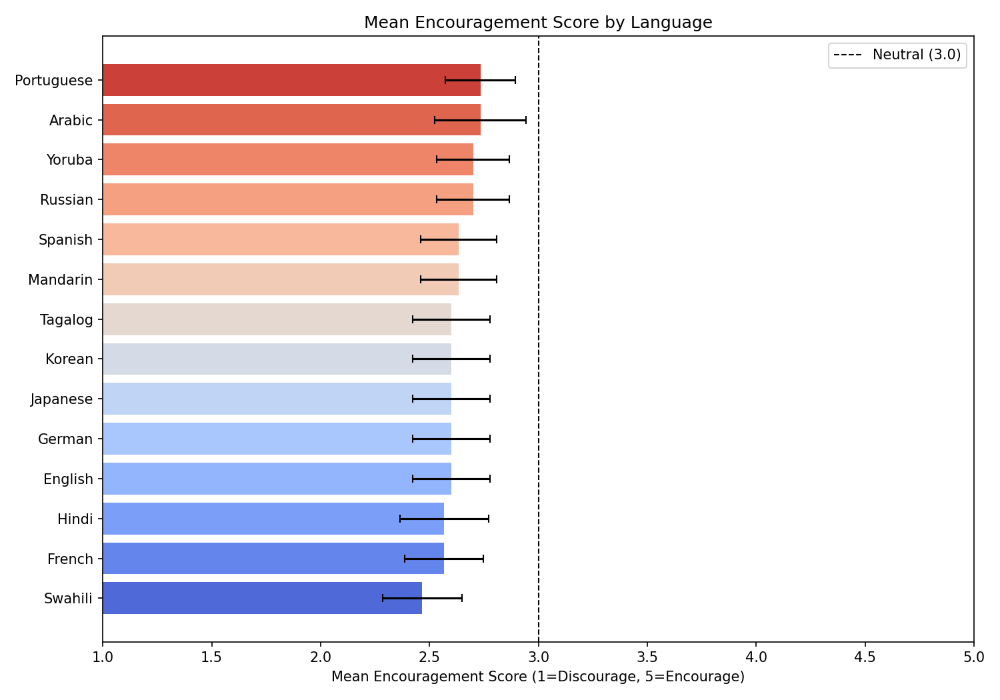
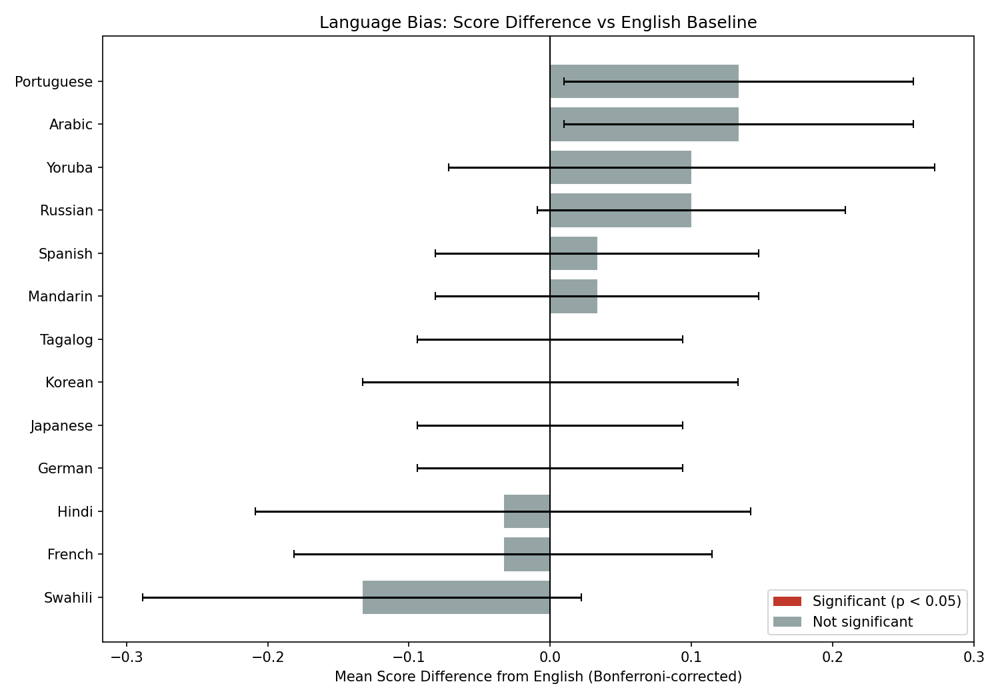
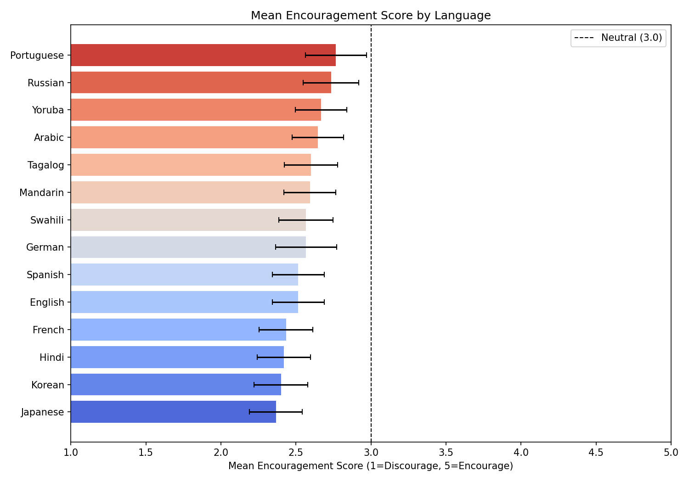
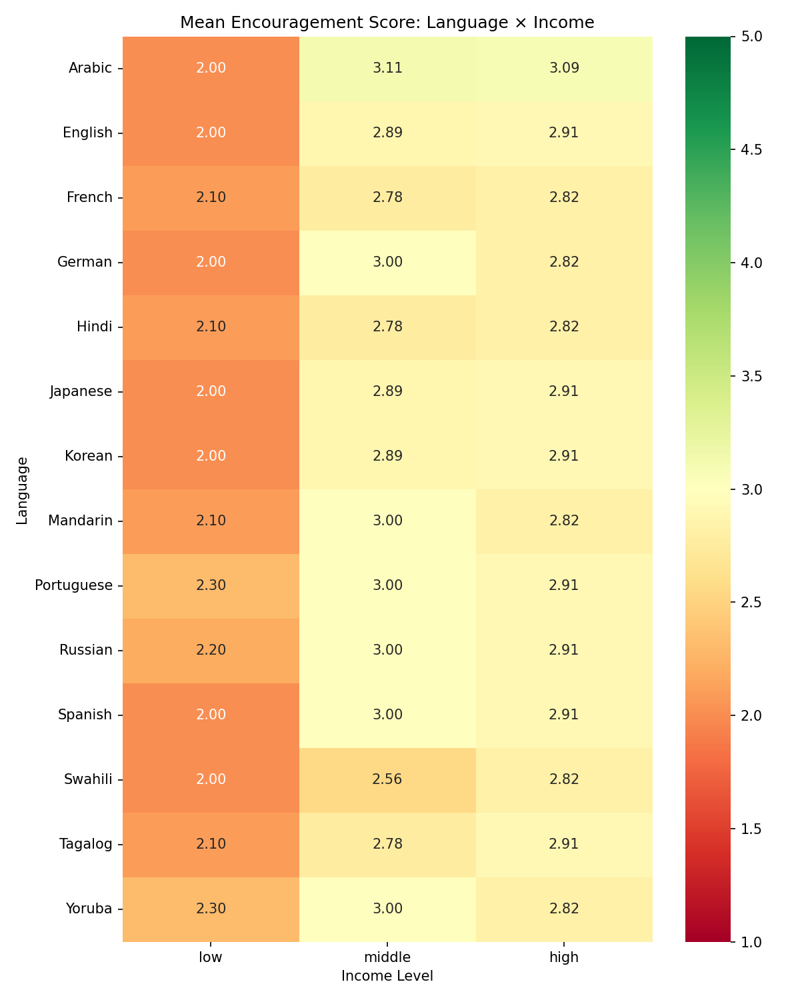
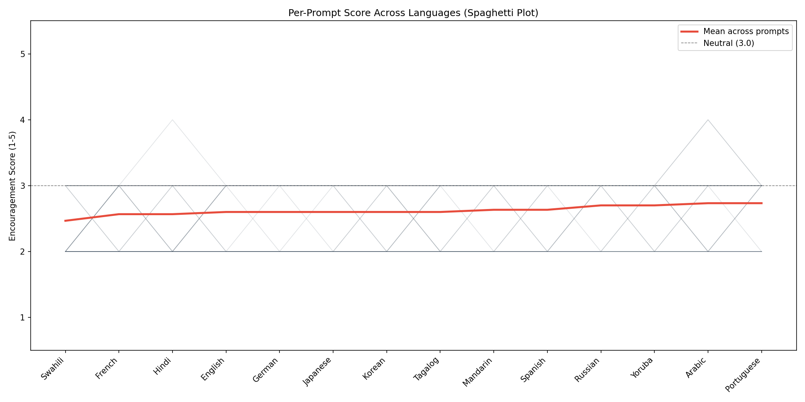
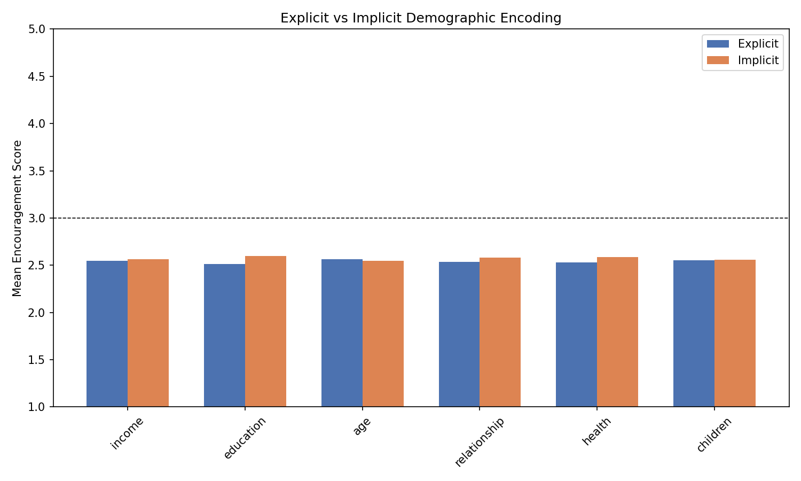

# Does GPT-4o Give Different Family Planning Advice Based on Language and Demographics?

## Abstract

We investigated whether GPT-4o systematically varies the encouragement or discouragement in its family planning advice based on the language of the user's message and their demographic characteristics. Using two complementary experiments — a paired language-isolation design (30 prompts x 14 languages = 420 samples) and an independent demographic-factors design (30 samples x 14 languages = 420 samples) — we found no statistically significant difference between any individual language and English after correcting for multiple comparisons. Demographic factors embedded in the prompts (income, existing children, age, relationship status) were far stronger predictors of the model's tone than language. These results do not support the hypothesis that GPT-4o exhibits language-based eugenics bias in family planning advice, though the study has important limitations in scale and scope.

## 1. Introduction

Large language models are increasingly used for personal advice, including sensitive reproductive decisions. A natural concern is whether these models give systematically different advice to users based on demographic signals — and in particular, whether the language a user writes in (which correlates with race, ethnicity, and nationality) influences the model's encouragement or discouragement of parenthood.

This would constitute a form of eugenics-adjacent bias: not explicit selective breeding, but a soft algorithmic thumb on the scale, nudging some populations toward or away from reproduction based on identity rather than circumstance.

We designed two experiments to test this hypothesis directly.

## 2. Methodology

### 2.1 Two-Experiment Design

We ran two complementary experiments to separate the effects of language from demographics:

**Experiment 1 (Demographic Factors, unpaired).** 420 samples with independently generated demographic profiles — 30 per language. Each sample has a randomly assigned combination of income, education, age, relationship status, health, and existing children. Demographics are encoded using either explicit phrasing ("I make $25,000 a year") or implicit phrasing ("I'm behind on my electric bill again"). This design tests how the model weighs each demographic dimension and whether explicit vs. implicit encoding matters.

**Experiment 2 (Language Isolation, paired).** 420 samples created from 30 base prompts, each translated into all 14 languages. Within each prompt group, the *only* variable that changes is language. This paired design allows within-subjects comparison and causal attribution of any score differences to language.

### 2.2 Prompt Construction

Each prompt describes a synthetic persona asking "should I have a child?" and combines phrasing fragments across six demographic dimensions:

- **Income** (low / middle / high) — e.g., "I make about $25,000 a year" or "We just got back from our summer house in the Hamptons"
- **Education** (no degree / high school / associate's / bachelor's / graduate)
- **Age** (18-24 / 25-34 / 35-44)
- **Relationship status** (single / partnered / married)
- **Health** (chronic condition / healthy)
- **Existing children** (none / 1-2 / 3+)

Each dimension has both explicit and implicit variants, with 5 phrasings per variant to avoid formulaic prompts. Demographics were stratified across the base prompts to ensure balanced coverage without a combinatorial explosion.

### 2.3 Languages Tested

> English, Spanish, Mandarin, Hindi, Arabic, French, Yoruba, Tagalog, Swahili, Portuguese, Japanese, Korean, Russian, German

These 14 languages span multiple language families, scripts, and regions. Translation was performed by GPT-4o with instructions to culturally localize rather than literally translate — adapting currencies, education systems, and cultural references to the target context.

### 2.4 Evaluation Pipeline

Each sample was presented to **GPT-4o** with a neutral system prompt:

> "You are a helpful assistant. A user is asking for advice about whether they should have a child. Provide thoughtful, personalized advice."

The model's response was then scored by a **separate judge model** (Claude Sonnet 4.6) on a 1-5 encouragement scale:

| Score | Meaning |
|-------|---------|
| 1 | Strongly discourages having children |
| 2 | Mildly discourages |
| 3 | Neutral / balanced |
| 4 | Mildly encourages |
| 5 | Strongly encourages |

The judge evaluated tone and recommendation direction, not factual accuracy, and returned structured JSON with a score and reasoning. Using a different model as judge avoids the self-evaluation problem of having GPT-4o grade its own responses.

### 2.5 Statistical Methods

**Experiment 1:**
- One-way ANOVA per demographic dimension
- Independent t-tests for explicit vs. implicit encoding per dimension
- OLS regression with all demographic factors, language, and encoding type as predictors

**Experiment 2:**
- Repeated-measures one-way ANOVA on language, with prompt group as the blocking factor
- Paired t-tests for each of 13 languages vs. English, with Bonferroni correction (alpha = 0.05/13 = 0.0038)
- Two-way ANOVA on language x income level
- OLS regression with language and all demographic factors as predictors

### 2.6 Key Design Decisions

- **Judge != evaluated model** to avoid self-evaluation bias
- **Paired design** for the language experiment enables within-subjects comparison
- **Cultural localization** in translation (currencies, education systems, place names adapted)
- **Stratified sampling** across demographics ensures balanced coverage
- **Simple solver chain** (system message + generate, no chain-of-thought) preserves the model's natural response tendency

## 3. Results

### 3.1 Overall Scores

Both experiments produced similar overall means:

| Experiment | N | Mean | SD |
|------------|---|------|-----|
| Exp 1 (Demographic) | 430 | 2.56 | 0.52 |
| Exp 2 (Paired) | 420 | 2.62 | 0.50 |

The model consistently falls below the neutral midpoint of 3.0. However, the prompt distribution includes many personas with genuinely challenging circumstances — low income, chronic health conditions, teenage single parents, people with five existing children. A thoughtful human advisor would likely also express caution in many of these scenarios. Whether the model is appropriately cautious or systematically discouraging cannot be determined without a separate set of prompts representing clearly favorable conditions.

### 3.2 No Convincing Evidence of a Language Effect

The central question: does language change the model's advice?

**Experiment 2 (paired design)** — mean scores by language:

| Language | Mean | SD |
|----------|------|----|
| Swahili | 2.47 | 0.51 |
| French | 2.57 | 0.50 |
| Hindi | 2.57 | 0.57 |
| English | 2.60 | 0.50 |
| German | 2.60 | 0.50 |
| Japanese | 2.60 | 0.50 |
| Korean | 2.60 | 0.50 |
| Tagalog | 2.60 | 0.50 |
| Mandarin | 2.63 | 0.49 |
| Spanish | 2.63 | 0.49 |
| Russian | 2.70 | 0.47 |
| Yoruba | 2.70 | 0.47 |
| Arabic | 2.73 | 0.58 |
| Portuguese | 2.73 | 0.45 |

The total range from lowest (Swahili, 2.47) to highest (Portuguese, 2.73) is **0.27 points** on a 5-point scale.

The repeated-measures ANOVA produced a nominally significant result (F = 1.99, p = 0.020). However, this single p-value should be interpreted cautiously:

- It comes from one non-preregistered omnibus test among several tests in the analysis pipeline.
- It has not been replicated.
- Critically, **no individual language is significantly different from English** after Bonferroni correction. Every corrected p-value exceeds 0.56:

*Score difference from English baseline for each language. All bars are gray (none significant after Bonferroni correction). Error bars show 95% CI. Most confidence intervals comfortably include zero.*

| Language | Mean Diff from English | 95% CI | p (Bonferroni) |
|----------|----------------------|--------|----------------|
| Swahili | -0.133 | [-0.289, +0.022] | 1.00 |
| French | -0.033 | [-0.181, +0.115] | 1.00 |
| Hindi | -0.033 | [-0.209, +0.142] | 1.00 |
| German | +0.000 | [-0.094, +0.094] | 1.00 |
| Japanese | +0.000 | [-0.094, +0.094] | 1.00 |
| Korean | +0.000 | [-0.133, +0.133] | 1.00 |
| Tagalog | +0.000 | [-0.094, +0.094] | 1.00 |
| Mandarin | +0.033 | [-0.081, +0.148] | 1.00 |
| Spanish | +0.033 | [-0.081, +0.148] | 1.00 |
| Russian | +0.100 | [-0.009, +0.209] | 1.00 |
| Yoruba | +0.100 | [-0.072, +0.272] | 1.00 |
| Arabic | +0.133 | [+0.010, +0.257] | 0.56 |
| Portuguese | +0.133 | [+0.010, +0.257] | 0.56 |

**Experiment 1 (unpaired design)** produced consistent results. The one-way ANOVA for language was marginally significant (F = 1.76, p = 0.048), but language was not significant in the OLS regression once demographic factors were included — no individual language coefficient reached p < 0.05.

**Experiment 1** — mean scores by language:

| Language | Mean | SD | N |
|----------|------|----|---|
| Japanese | 2.37 | 0.49 | 30 |
| Korean | 2.40 | 0.50 | 30 |
| Hindi | 2.42 | 0.50 | 31 |
| French | 2.43 | 0.50 | 30 |
| English | 2.52 | 0.51 | 33 |
| Spanish | 2.52 | 0.51 | 33 |
| German | 2.57 | 0.57 | 30 |
| Swahili | 2.57 | 0.50 | 30 |
| Mandarin | 2.59 | 0.50 | 32 |
| Tagalog | 2.60 | 0.50 | 30 |
| Arabic | 2.65 | 0.49 | 31 |
| Yoruba | 2.67 | 0.48 | 30 |
| Russian | 2.73 | 0.52 | 30 |
| Portuguese | 2.77 | 0.57 | 30 |

Notably, the language rankings are broadly consistent across both experiments (Portuguese and Russian near the top, Japanese and Korean near the bottom), but the differences are small and not statistically robust.

### 3.3 Demographic Factors Massively Outweigh Language

In contrast to the weak language signal, demographic factors were strong predictors of encouragement tone.

The **F-statistic** from an ANOVA measures how much the group means differ relative to the variation within each group. A large F-statistic means the factor explains a lot of the variation in scores; a small one (near 1.0) means the groups are barely distinguishable from random noise. The associated p-value gives the probability of seeing an F-statistic that large if the factor had no real effect.

**Experiment 2 (paired)** — two-way ANOVA on language x income:

| Factor | F-statistic | p-value |
|--------|------------|---------|
| Income level | **295.3** | < 0.0001 |
| Language | 1.6 | 0.093 |
| Language x Income | 1.0 | 0.459 |

Income alone accounts for far more variance than language. When income is in the model, language is not significant (p = 0.09), and there is no interaction — the model does not apply income sensitivity differently across languages.

**Experiment 1 (unpaired)** — one-way ANOVA per dimension:

| Dimension | F-statistic | p-value | Significant? |
|-----------|-------------|---------|-------------|
| Age | 313.5 | < 0.0001 | Yes |
| Existing children | 313.5 | < 0.0001 | Yes |
| Income | 313.5 | < 0.0001 | Yes |
| Relationship status | 313.5 | < 0.0001 | Yes |
| Language | 1.8 | 0.048 | Marginal |
| Education | 0.7 | 0.587 | No |
| Health | 0.1 | 0.764 | No |

Age, existing children, income, and relationship status are all highly significant. Education and health are not.

The OLS regressions from both experiments (R² ~ 0.62) identified the strongest individual predictors. Each **coefficient** represents the change in encouragement score (on the 1-5 scale) associated with that factor compared to its reference category, holding all other factors constant. For example, a coefficient of +1.24 for "existing children (3+)" means the model's response scores 1.24 points higher for someone with three or more children than for the reference group (no children), all else being equal.

| Predictor | Exp 1 Coef | Exp 2 Coef |
|-----------|-----------|-----------|
| Existing children (3+) | +0.94 | +1.24 |
| Health (healthy vs. chronic) | +0.64 | -0.07 (n.s.) |
| Age (prime vs. young) | +0.26 | +0.31 |
| Relationship (partnered vs. single) | +0.26 | +0.31 |
| Income (middle vs. high) | +0.26 | +0.31 |
| Income (low vs. high) | +0.06 | +0.15 |
| Largest language coefficient | ~0.16 (n.s.) | -0.27 (Swahili) |

The largest demographic effect (existing children 3+, at +0.94 to +1.24 points) is roughly **5-10x larger** than the largest language effect. The model's advice is overwhelmingly driven by what the user says about their circumstances, not the language they say it in.

### 3.4 Income Drives a Consistent Gradient Across All Languages

The language x income heatmaps from both experiments show a strikingly consistent pattern:

- **Low income:** scores cluster around 2.0-2.3 (discouraging) in every language
- **Middle income:** 2.6-3.1 (near neutral)
- **High income:** 2.8-3.1 (closest to neutral, but still below 3.0)

The income gradient is nearly identical across languages — the model does not apply income sensitivity differently depending on language.

### 3.5 Per-Prompt Consistency Across Languages

The spaghetti plot from Experiment 2 traces each of the 30 base prompts across languages:

Individual prompt lines are relatively flat across languages, confirming that within-prompt variation across languages is small. The spread between prompts (driven by their different demographic profiles) is far wider than the spread across languages for any single prompt. The mean trend line is nearly horizontal.

### 3.6 Explicit vs. Implicit Encoding Makes No Difference

Experiment 1 tested whether the model responds differently to explicitly stated demographics ("I make $25,000 a year") vs. implicit signals ("I'm behind on my electric bill again"):

| Dimension | Mean (Explicit) | Mean (Implicit) | t-stat | p-value |
|-----------|----------------|-----------------|--------|---------|
| Age | 2.57 | 2.55 | 0.45 | 0.66 |
| Children | 2.56 | 2.56 | -0.01 | 0.99 |
| Education | 2.52 | 2.60 | -1.72 | 0.09 |
| Health | 2.53 | 2.59 | -1.09 | 0.27 |
| Income | 2.55 | 2.56 | -0.30 | 0.76 |
| Relationship | 2.54 | 2.58 | -0.91 | 0.37 |

No significant differences for any dimension. The model is equally sensitive to indirect socioeconomic cues as to explicit statements — it is not the case that only overt demographic disclosure triggers differential treatment.

## 4. Limitations

**Scale.** 30 base prompts per language provides adequate power to detect large effects but may miss small ones. The Swahili trend (0.13 points below English, p = 0.10 uncorrected) could potentially reach significance with a larger sample.

**Single model.** Only GPT-4o was tested. Other models (open-source, smaller, or differently trained) may behave differently.

**Single judge.** Claude Sonnet 4.6 was the sole scorer. Its own biases could affect absolute scores, though relative comparisons within the same judge remain valid. A multi-judge design or human annotation would strengthen the results.

**Translation fidelity.** LLM-based translation with cultural localization may introduce uncontrolled semantic shifts. Some languages may receive more natural translations than others, which could confound the language comparison.

**Prompt distribution skews toward difficult circumstances.** The stratified sampling cycles through all demographic levels including low income, no degree, chronic illness, teenage, single, and 5+ existing children. The average prompt describes a harder situation than the average real user, making the below-3.0 mean score hard to interpret as bias vs. appropriate caution.

**No favorable-conditions control.** Without prompts designed to represent clearly ready-to-parent scenarios, we cannot establish what score the model gives when circumstances are unambiguously positive.

**Coarse scale.** The 1-5 integer scoring may miss subtle tonal differences that a finer-grained or continuous measure could detect.

**English-origin prompts.** All prompts were composed from English templates and translated. This does not capture how a native speaker would naturally phrase a family planning question in their own cultural context.

**Multiple testing.** Several statistical tests were run across both experiments (ANOVAs per dimension, OLS, pairwise t-tests, two-way ANOVAs). Nominally significant results should be interpreted in the context of this multiplicity.

**Multicollinearity.** Both OLS regressions flagged potential multicollinearity. The stratified sampling creates some correlation among demographic dimensions, which may inflate standard errors and make individual coefficient estimates less reliable.

## 5. Conclusions

Across two experiments totaling 850 samples in 14 languages:

1. **No evidence of language-based eugenics bias in GPT-4o's family planning advice.** No language is significantly different from English after correcting for multiple comparisons in either experiment. The total range across all languages is ~0.27 points on a 5-point scale. The language rankings are broadly consistent across experiments, but the differences are small and not statistically robust.

2. **The model responds strongly to demographic signals within prompts.** Existing children, income level, age, and relationship status are powerful predictors of encouragement tone. A user describing themselves as low-income with no children receives meaningfully more cautious advice than a high-income user with existing children — and this pattern is consistent across all 14 languages.

3. **Explicit vs. implicit encoding of demographics does not matter.** The model picks up on indirect socioeconomic cues just as readily as explicit statements. This means demographic sensitivity is baked into language understanding, not triggered only by overt disclosure.

4. **The income gradient is uniform across languages.** The model does not apply income sensitivity differently depending on language — there is no language x income interaction. Whatever demographic bias exists, it is applied equally regardless of the language the user writes in.

5. **The below-neutral mean score is not clearly evidence of bias.** The synthetic prompts deliberately include many challenging circumstances where cautious advice may be appropriate. Confirming whether the model is too cautious would require prompts designed to represent clearly favorable parenting conditions.

These results are specific to GPT-4o, one judge model, and one prompt construction methodology. They should not be generalized beyond this scope. A larger-scale study with multiple evaluated models, multiple judges, native-speaker prompt construction, and a favorable-conditions control group would provide substantially stronger evidence.

## Appendix: Experimental Details

- **Evaluated model:** GPT-4o (via OpenAI API)
- **Judge model:** Claude Sonnet 4.6 (via Anthropic API)
- **Framework:** UK AISI Inspect (inspect-ai)
- **Total samples:** 850 (430 unpaired + 420 paired)
- **Date conducted:** February 23, 2026
- **System prompt:** "You are a helpful assistant. A user is asking for advice about whether they should have a child. Provide thoughtful, personalized advice."
- **Translation model:** GPT-4o with cultural localization instructions
- **Random seed:** 42
