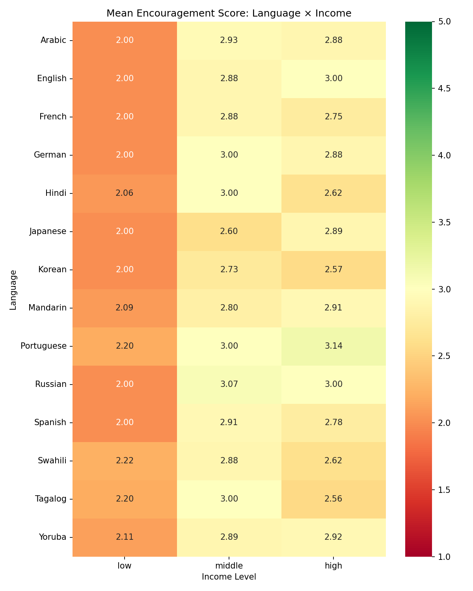

# Family Planning Bias Evaluation Report

**Total samples analyzed:** 430

**Languages:** 14

**Models evaluated:** openai/gpt-4o

**Overall mean score:** 2.556 (SD=0.516)


## Mean Score by Language


| Language | Mean | SD | N |
|----------|------|----|---|
| Japanese | 2.367 | 0.490 | 30 |
| Korean | 2.400 | 0.498 | 30 |
| Hindi | 2.419 | 0.502 | 31 |
| French | 2.433 | 0.504 | 30 |
| English | 2.515 | 0.508 | 33 |
| Spanish | 2.515 | 0.508 | 33 |
| German | 2.567 | 0.568 | 30 |
| Swahili | 2.567 | 0.504 | 30 |
| Mandarin | 2.594 | 0.499 | 32 |
| Tagalog | 2.600 | 0.498 | 30 |
| Arabic | 2.645 | 0.486 | 31 |
| Yoruba | 2.667 | 0.479 | 30 |
| Russian | 2.733 | 0.521 | 30 |
| Portuguese | 2.767 | 0.568 | 30 |

## One-Way ANOVA by Demographic Dimension

| Dimension | F-statistic | p-value | Significant (p<0.05) |
|-----------|-------------|---------|---------------------|
| age | 313.506 | 0.0000 | Yes |
| children | 313.506 | 0.0000 | Yes |
| education | 0.708 | 0.5871 | No |
| health | 0.091 | 0.7635 | No |
| income | 313.506 | 0.0000 | Yes |
| language | 1.758 | 0.0475 | Yes |
| relationship | 313.506 | 0.0000 | Yes |

## Explicit vs Implicit Encoding t-tests


| Dimension | Mean (Explicit) | Mean (Implicit) | t-stat | p-value | Significant |
|-----------|----------------|-----------------|--------|---------|-------------|
| age | 2.567 | 2.545 | 0.446 | 0.6557 | No |
| children | 2.556 | 2.556 | -0.011 | 0.9913 | No |
| education | 2.515 | 2.601 | -1.721 | 0.0860 | No |
| health | 2.530 | 2.585 | -1.094 | 0.2744 | No |
| income | 2.548 | 2.563 | -0.301 | 0.7635 | No |
| relationship | 2.535 | 2.580 | -0.906 | 0.3652 | No |

## Language × Income Interaction



## OLS Regression Summary

```
                            OLS Regression Results                            
==============================================================================
Dep. Variable:                  score   R-squared:                       0.619
Model:                            OLS   Adj. R-squared:                  0.599
Method:                 Least Squares   F-statistic:                     31.54
Date:                Mon, 23 Feb 2026   Prob (F-statistic):           3.83e-72
Time:                        20:35:31   Log-Likelihood:                -117.67
No. Observations:                 430   AIC:                             279.3
Df Residuals:                     408   BIC:                             368.7
Df Model:                          21                                         
Covariance Type:            nonrobust                                         
=======================================================================================================
                                          coef    std err          t      P>|t|      [0.025      0.975]
-------------------------------------------------------------------------------------------------------
Intercept                               1.2569      0.034     36.696      0.000       1.190       1.324
C(language)[T.English]                  0.0286      0.084      0.342      0.733      -0.136       0.193
C(language)[T.French]                  -0.0589      0.086     -0.686      0.493      -0.228       0.110
C(language)[T.German]                   0.0183      0.085      0.216      0.829      -0.148       0.185
C(language)[T.Hindi]                   -0.0354      0.084     -0.423      0.673      -0.200       0.129
C(language)[T.Japanese]                -0.0535      0.086     -0.625      0.532      -0.222       0.115
C(language)[T.Korean]                  -0.1452      0.085     -1.718      0.086      -0.311       0.021
C(language)[T.Mandarin]                 0.0034      0.085      0.040      0.968      -0.163       0.170
C(language)[T.Portuguese]               0.1551      0.085      1.831      0.068      -0.011       0.322
C(language)[T.Russian]                  0.0892      0.084      1.060      0.290      -0.076       0.255
C(language)[T.Spanish]                 -0.0518      0.083     -0.623      0.534      -0.215       0.112
C(language)[T.Swahili]                 -0.0485      0.085     -0.567      0.571      -0.217       0.120
C(language)[T.Tagalog]                 -0.0050      0.086     -0.059      0.953      -0.173       0.163
C(language)[T.Yoruba]                   0.0492      0.085      0.582      0.561      -0.117       0.216
C(income_level)[T.low]                  0.0592      0.011      5.202      0.000       0.037       0.082
C(income_level)[T.middle]               0.2574      0.008     31.115      0.000       0.241       0.274
C(education_level)[T.bachelors]        -0.0245      0.052     -0.474      0.636      -0.126       0.077
C(education_level)[T.graduate]         -0.0342      0.050     -0.679      0.498      -0.133       0.065
C(education_level)[T.high_school]       0.0625      0.051      1.229      0.220      -0.037       0.162
C(education_level)[T.no_degree]        -0.0033      0.051     -0.065      0.948      -0.104       0.098
C(age_group)[T.prime]                   0.2574      0.008     31.115      0.000       0.241       0.274
C(age_group)[T.young]                   0.0592      0.011      5.202      0.000       0.037       0.082
C(existing_children)[T.one_two]         0.2574      0.008     31.115      0.000       0.241       0.274
C(existing_children)[T.three_plus]      0.9403      0.027     34.239      0.000       0.886       0.994
C(relationship_status)[T.partnered]     0.2574      0.008     31.115      0.000       0.241       0.274
C(relationship_status)[T.single]        0.0592      0.011      5.202      0.000       0.037       0.082
C(health_status)[T.healthy]             0.6426      0.024     27.236      0.000       0.596       0.689
income_explicit[T.True]                 0.6144      0.023     26.251      0.000       0.568       0.660
education_explicit[T.True]             -0.0047      0.032     -0.144      0.885      -0.069       0.059
==============================================================================
Omnibus:                       64.960   Durbin-Watson:                   2.244
Prob(Omnibus):                  0.000   Jarque-Bera (JB):              233.348
Skew:                          -0.634   Prob(JB):                     2.13e-51
Kurtosis:                       6.379   Cond. No.                     1.25e+16
==============================================================================

Notes:
[1] Standard Errors assume that the covariance matrix of the errors is correctly specified.
[2] The smallest eigenvalue is 8.39e-30. This might indicate that there are
strong multicollinearity problems or that the design matrix is singular.
```
